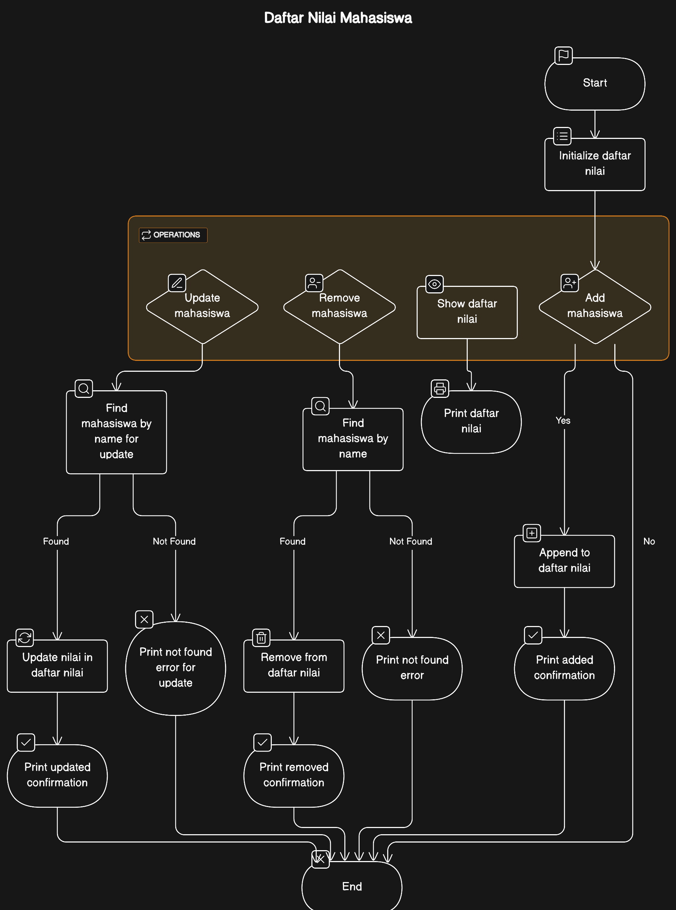
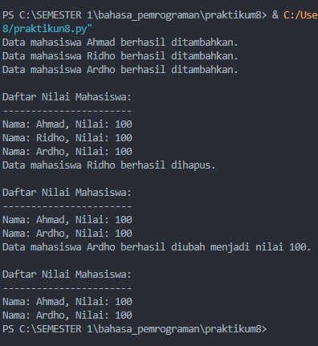

| Nama                | Nim       | Kelas    |
| ------------------- | --------- | -------- |
| Ahmad Ridho Septian | 312310447 | TI.23.A5 |

# Praktikum 8

## Diagram Class

| Daftar Nilai Mahasiswa   |
| ------------------------ |
| - daftar_nilai: list     |
| ------------------------ |
| + **init**()             |
| + tambah(nama, nilai)    |
| + tampilkan()            |
| + hapus(nama)            |
| + ubah(nama, nilai)      |

## Flowchart



## code

```python
class DaftarNilaiMahasiswa:
    def __init__(self):
        self.daftar_nilai = []

    def tambah(self, nama, nilai):
        mahasiswa = {'nama': nama, 'nilai': nilai}
        self.daftar_nilai.append(mahasiswa)
        print(f"Data mahasiswa {nama} berhasil ditambahkan.")

    def tampilkan(self):
        print("\nDaftar Nilai Mahasiswa:")
        print("-"*23)
        for mahasiswa in self.daftar_nilai:
            print(f"Nama: {mahasiswa['nama']}, Nilai: {mahasiswa['nilai']}")

    def hapus(self, nama):
        for mahasiswa in self.daftar_nilai:
            if mahasiswa['nama'] == nama:
                self.daftar_nilai.remove(mahasiswa)
                print(f"Data mahasiswa {nama} berhasil dihapus.")
                return
        print(f"Mahasiswa dengan nama {nama} tidak ditemukan.")

    def ubah(self, nama, nilai_baru):
        for mahasiswa in self.daftar_nilai:
            if mahasiswa['nama'] == nama:
                mahasiswa['nilai'] = nilai_baru
                print(f"Data mahasiswa {nama} berhasil diubah menjadi nilai {nilai_baru}.")
                return
        print(f"Mahasiswa dengan nama {nama} tidak ditemukan.")

# Contoh penggunaan program
daftar_nilai_mahasiswa = DaftarNilaiMahasiswa()

daftar_nilai_mahasiswa.tambah("Ahmad", 100)
daftar_nilai_mahasiswa.tambah("Ridho", 100)
daftar_nilai_mahasiswa.tambah("Ardho", 100)


daftar_nilai_mahasiswa.tampilkan()

daftar_nilai_mahasiswa.hapus("Ridho")
daftar_nilai_mahasiswa.tampilkan()

daftar_nilai_mahasiswa.ubah("Ardho", 100)
daftar_nilai_mahasiswa.tampilkan()

```

### Output



## Penjelasan

#### 1. Class DaftarNilaiMahasiswa:

- `__init__(self)`: Method ini merupakan konstruktor class yang digunakan untuk inisialisasi objek saat dibuat. Dalam hal ini, objek `DaftarNilaiMahasiswa` memiliki atribut daftar_nilai yang diinisialisasi sebagai sebuah list kosong.

- `tambah(self, nama, nilai)`: Method ini digunakan untuk menambahkan data mahasiswa ke dalam daftar nilai. Setiap data mahasiswa disimpan dalam bentuk dictionary dengan kunci 'nama' dan 'nilai', lalu ditambahkan ke dalam list `daftar_nilai`.

- `tampilkan(self)`: Method ini digunakan untuk menampilkan seluruh daftar nilai mahasiswa. Menggunakan loop, setiap elemen di dalam `daftar_nilai` diprint dengan format tertentu.

- `hapus(self, nama)`: Method ini digunakan untuk menghapus data mahasiswa berdasarkan nama. Method ini melakukan pencarian nama di dalam daftar_nilai dan menghapus data jika ditemukan.

- `ubah(self, nama, nilai_baru)`: Method ini digunakan untuk mengubah nilai mahasiswa berdasarkan nama. Method ini mencari nama di dalam daftar_nilai dan mengubah nilai jika ditemukan.

#### 2. Contoh Penggunaan Program:

- Membuat objek `daftar_nilai_mahasiswa` dari class `DaftarNilaiMahasiswa`.

- Memanggil beberapa method pada objek tersebut untuk menambahkan, menampilkan, menghapus, dan mengubah data mahasiswa.

- Contoh penggunaan termasuk menambahkan tiga mahasiswa, menampilkan daftar nilai, menghapus mahasiswa dengan nama "Ridho", mengubah nilai mahasiswa dengan nama "Ardho", dan kembali menampilkan daftar nilai.

#### 3. Catatan Penting:

- Program ini bersifat sederhana dan hanya bertujuan sebagai contoh. Dalam aplikasi nyata, mungkin perlu ditambahkan fitur keamanan, validasi input, dan penanganan kesalahan lebih lanjut.

- Penggunaan class memungkinkan untuk mengorganisasi dan mengelola data dengan lebih terstruktur, memisahkan logika program ke dalam bagian-bagian yang terpisah (method), dan memfasilitasi pemeliharaan dan pengembangan lebih lanjut.
